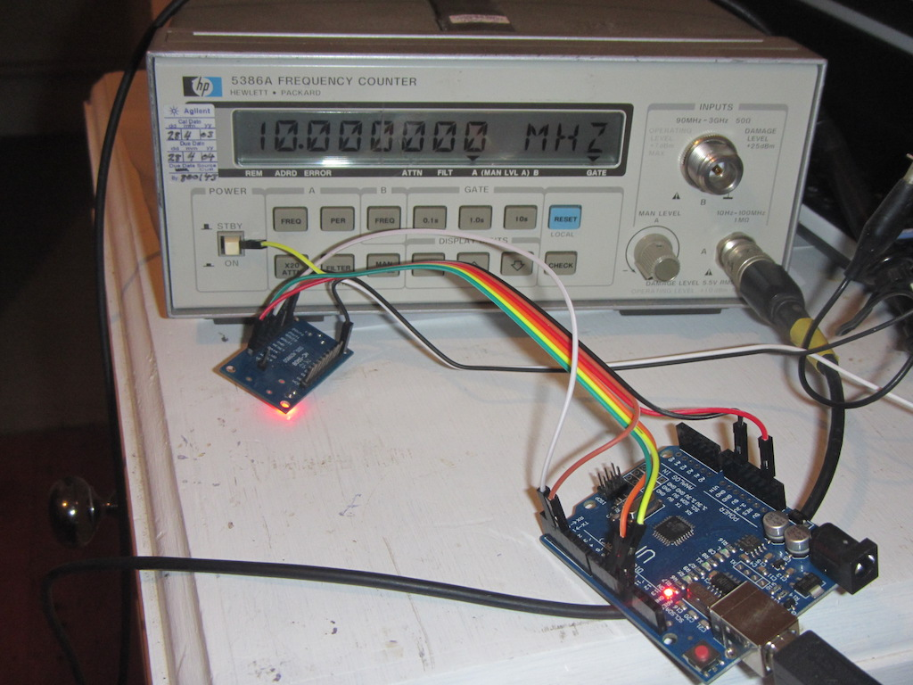

# AD9851 Direct Digital Synthesis Arduino Library

AD9851 is a chip from Analog Devices for direct digital sythesis of radio frequency signals.
This is a template class for controlling the AD9851.

## Setup Functions

Instantiate the AD9851 template with the appropriate parameters.
You must provide a Reset pin and a digital pin number to be used for chip select (FQ/UD):
The SPI SCK and MOSI pins will be used automatically.

    #define AD9851_RESET_PIN      3
    #define AD9851_FQ_UD_PIN      2

    class MyAD9851 : public AD9851<AD9851_RESET_PIN, AD9851_FQ_UD_PIN> {};
    MyAD9851 dds;

If you have a good frequency counter, you can calibrate your AD9851.
Generate 10MHz, and measure the frequency. Provide this value as the
third template parameter:

    #define CALIBRATION		9999943

    class MyAD9851 : public AD9851<AD9851_RESET_PIN, AD9851_FQ_UD_PIN, CALIBRATION> {};

The fourth template parameter is the SPI data rate, default 2Mb/s.
You should not try to alter the fifth and sixth parameters, as
these are set by the SPI hardware used.

The AD9851 reset will be applied at the time this constructor is run.
Alternatively, you can reset the chip at any time later:

    dds.reset();

## Setting the frequency

The setFrequency() function tells the module what frequency to generate.

      dds.setFrequency(7140000UL);
